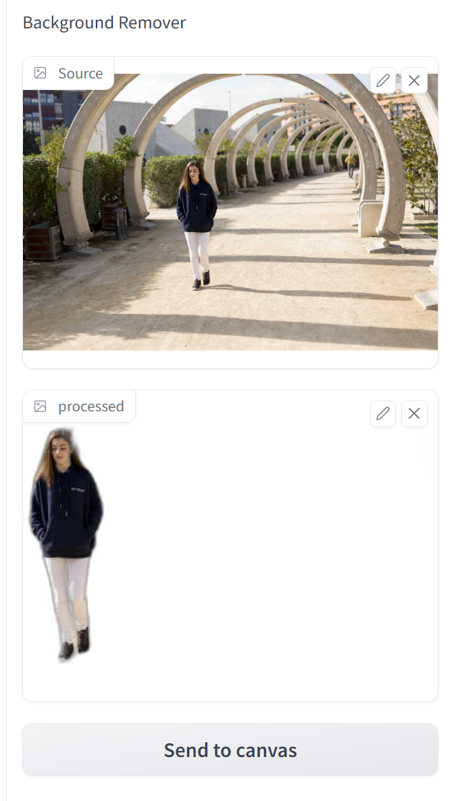
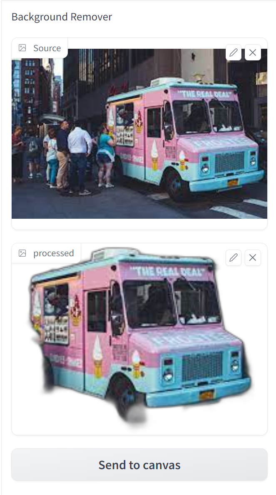
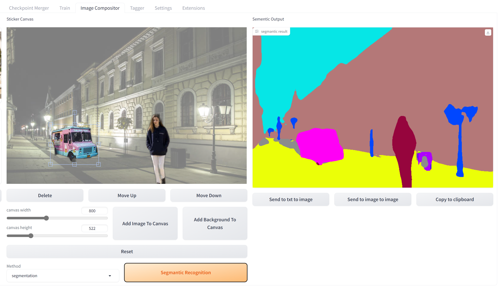
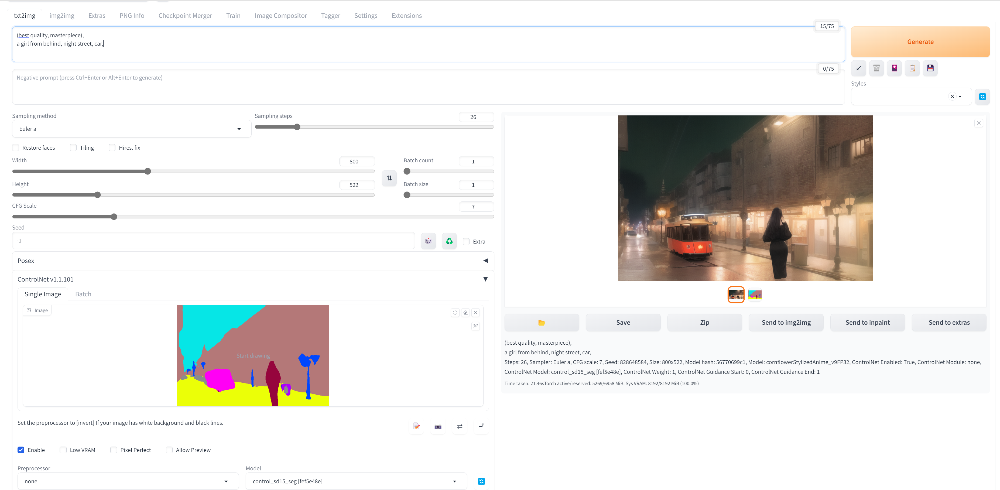

[English](./readme_en.md) | 简体中文

# 拼图大师：WebUI插件，让你的编辑更高效

使用该插件，可以在一个页面内实现抠图，拼图，并且为Controlnet生成底图，传统的做法需要使用两至三个不同的软件，来回跳转，该工具大大简化了这个操作

# 安装
1：安装[ControlNet](https://github.com/Mikubill/sd-webui-controlnet)插件 
2：将本插件下载到 ${sd-webui}/extensions 目录下

使用前需要注意：首次使用插件需要重启 sd-webui 以安装rembg库，而不是重启UI。

# 可能出现的问题
1：第一次使用时，如果你之前没有在ControlNet中使用过oneformer的模型，那么需要下载相应的模型才能使用，一般来说，如果没有模型，会自动下载 
2：如果下载模型时，出现问题，可以通过以下链接：https://pan.baidu.com/s/1fIwQ7f08uV3FjAPLbKbinQ?pwd=cso5 提取码：cso5 进行下载 
3：下载后，将downloads放入image-compositor/annotator文件夹下即可 
4：如果需要使用中文，请将chinese-all-0408.json放入stable-diffusion\localizations目录下，并在设置中启用它 

## 使用方式
本插件的大致使用流程为： 
1.搜集需要拼接的图片元素 
2.将需要拼接的元素放入画布  
3.将画布转化成语义图 
4.使用controlnet和语义图生成新的图片 
接下来详细说明每个步骤： 

### 步骤 1:

使用移除背景功能，提取图片中的主要元素。如下图所示，我们在Source框中上传了一张一个女孩走在一条有拱门的路上，然后从processed框中得到了正在走路的女孩。在右边使用同样的方法得到了一辆车
  

### 步骤 2:

将多个元素整合到画布上，并转化成语义图。如下图所示，我们首先在画布中添加了一张夜晚城市街道的图片作为背景 (Add Background To Canvas 按钮)，然后把女孩和车都发送到了画布上 (Send to canvas 按钮) ，并调整了他们的大小和位置，使他们在街道上看上去比较自然，最后将整个画布转化成了一张语义图 (Segmantic Recognition 按钮) 。
 

### 步骤 3:

将语义图发送到controlnet上 (Send to txt to image 按钮) ，然后启用controlnet，并选择 control_sd15_seg 作为 Model，选择none作为Preprocessor
 

### 步骤 4:

输入合适的prompt，生成图片
 
